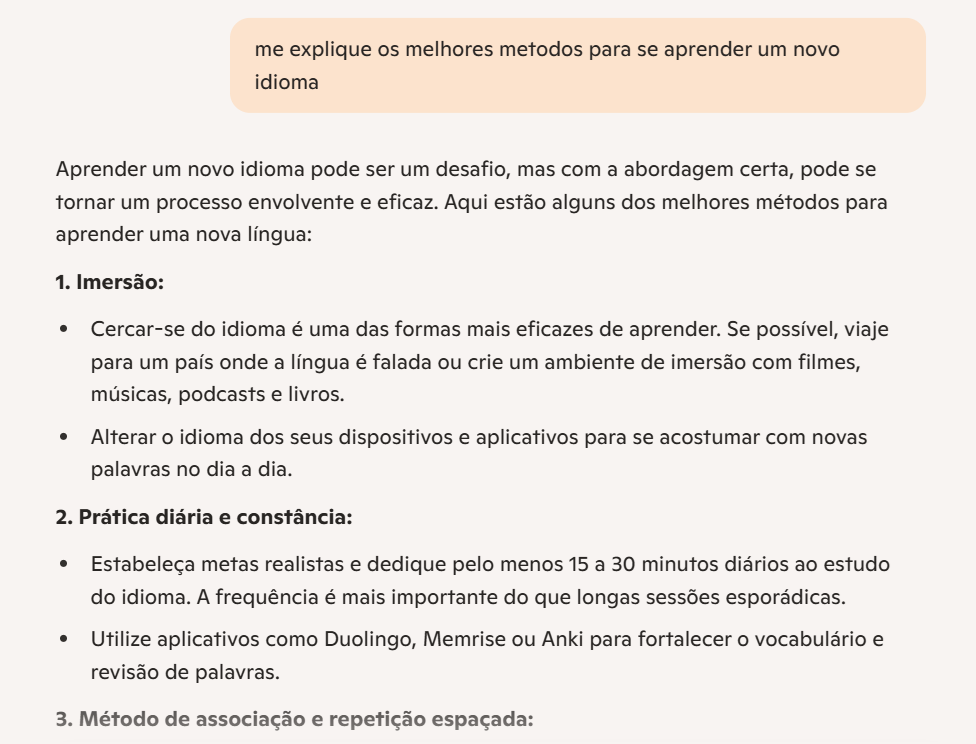
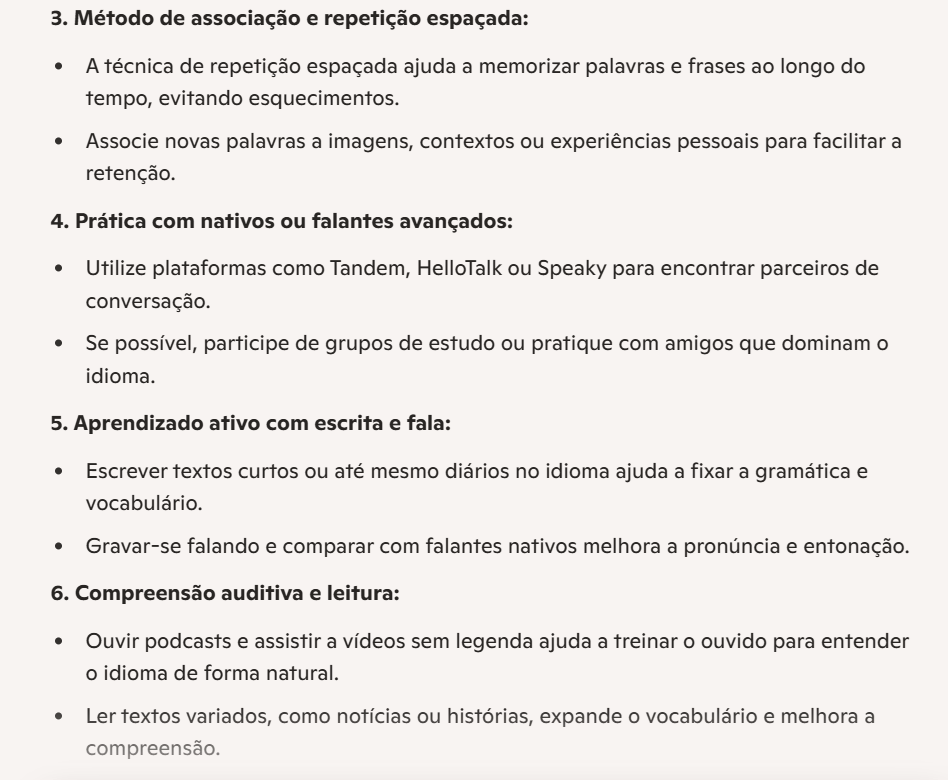

# Microsoft Copilot: Explorando a Pesquisa de Texto e Imagem com IA

## Introdução

O Microsoft Copilot é uma poderosa ferramenta de inteligência artificial que atua como um assistente integrado aos produtos da Microsoft, como Word, Excel, PowerPoint, e também ao navegador com o Bing Chat. Ele utiliza IA generativa para ajudar os usuários a pesquisar, gerar conteúdo, analisar informações e automatizar tarefas.

Um dos recursos mais úteis é sua capacidade de realizar pesquisas inteligentes com base em texto e imagens, permitindo encontrar informações relevantes de maneira mais intuitiva e dinâmica. Isso torna o Copilot especialmente útil para estudantes, profissionais e desenvolvedores que desejam melhorar a produtividade e a tomada de decisões.

---

## Exemplo de Uso

Abaixo, segue um print da interface de teste onde realizei uma simulação de uso da IA para busca de informações por texto:

---

## Exemplo de Uso Com Imagens

Fiz uma busca por imagem usando o seguinte prompt: **Gere uma imagem de uma mulher estudando coreano**. Este foi o resultado:

Em seguida fiz uma segunda pesquisa usando o prompt: **Agora gere uma imagem de uma mansão com piscina de borda infinita**. A imagem gerada foi a seguinte:

## Conclusão

Durante o uso do Microsoft Copilot, foi possível observar como a IA generativa está transformando a forma como interagimos com a informação. A ferramenta oferece respostas rápidas, contextualizadas e com base em diversas fontes, otimizando o tempo de pesquisa e aumentando a eficiência.

Essas soluções de IA também demonstram grande potencial em aplicações corporativas, como atendimento ao cliente, análise de dados e suporte técnico.

 A experiência foi enriquecedora e mostrou como ferramentas de IA podem ser grandes aliadas no dia a dia de trabalho e estudo.

---

